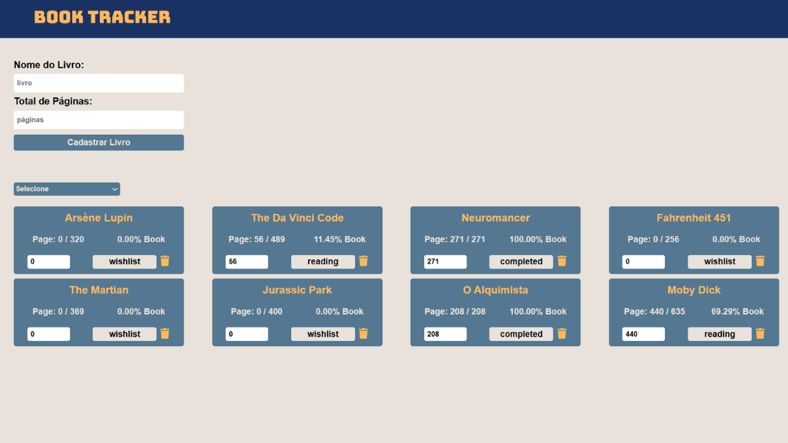

# Book Tracker


## Sobre o projeto

O **Book Tracker** é uma aplicação web desenvolvida com **React** e **TypeScript** para ajudar usuários a **organizar e acompanhar suas leituras**. O projeto permite cadastrar livros, atualizar o progresso de leitura em páginas e acompanhar automaticamente o **status do livro** (quero ler, lendo ou concluído). O foco principal do projeto é **prática de lógica, organização de estado, refatoração e boas práticas com React**.

---

## Layout

Layout simples e funcional, focado em usabilidade e clareza de informações.

<p align="center">
  
</p>

---

## Tecnologias utilizadas

O projeto foi desenvolvido com as seguintes tecnologias:

* **ReactJS** — Construção da interface
* **TypeScript** — Tipagem estática e segurança
* **Hooks (useState, useEffect, custom hooks)** — Gerenciamento de estado
* **Vite** — Build e servidor de desenvolvimento
* **CSS** — Estilização da aplicação
* **LocalStorage** — Persistência de dados

---

## Funcionalidades

* Cadastro de livros
* Definição do total de páginas
* Atualização do progresso de leitura
* Status automático do livro:

  * `wishlist` → Quero ler
  * `reading` → Lendo
  * `completed` → Concluído
* Filtro por status de leitura
* Remoção de livros
* Alertas ao adicionar e excluir livros
* Persistência dos dados no navegador

---

## Como rodar o projeto

### Pré-requisitos

* [Node.js](https://nodejs.org/)
* [Git](https://git-scm.com/)

### Clonando o repositório

```bash
git clone https://github.com/jotavitorz/book-tracker.git
```

### Instalando dependências

```bash
npm install
```

### Executando o projeto

```bash
npm run dev
```

O projeto será iniciado em:

> [http://localhost:5173](http://localhost:5173)

## Observações

Projeto desenvolvido com foco em **aprendizado, prática e portfólio**.
Não utiliza backend — os dados são armazenados localmente. Ideal para demonstrar domínio de **estado, lógica e refatoração em React**.

<p align="center">Feito por <b>João Vitor</b> 🖖</p>
